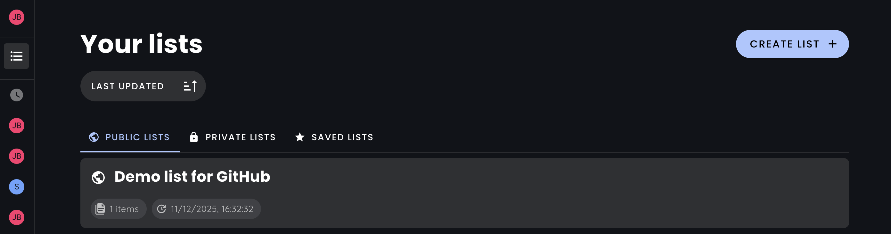
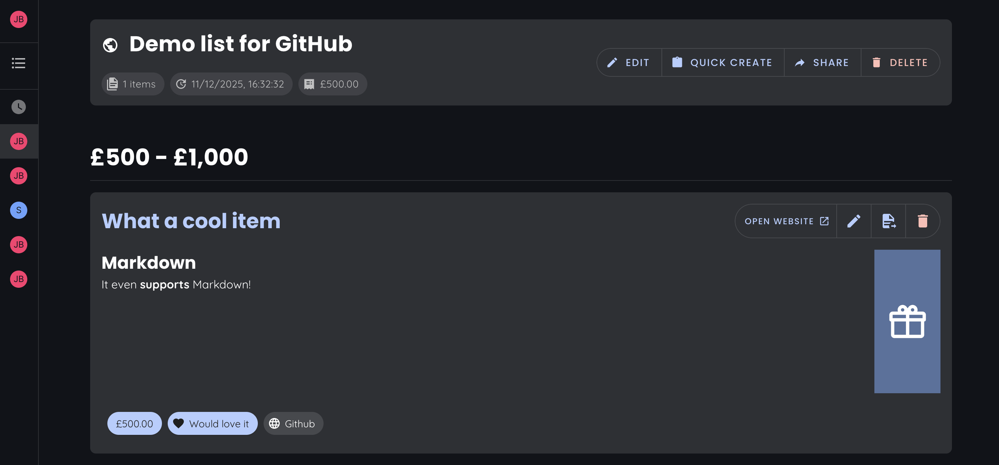

# Readyto.gift




This is a simple Wishlist app, to keep track of things you'd like. If anyone buys you anything from it, they can mark it down as such, so you don't get duplicates.

## Why did I make this?

- Amazon wishlists are very limited
- A google doc or notion page lacks a few features, like the author not knowing what has been purchased
- [wishthis](https://github.com/wishthis/wishthis) is a good alternative for this, and this was inspired by it. However, I liked a few things to be done in a different way.

## Stack

- Frontend: Vue (w/ Vite) + Pinia + Vuetify
    - Familiar, nicely reactive and wanted to try out something like Vuetify - also means I didn't need to design this beforehand.
    - This isn't the most performant app. I could've gone with a more efficient setup, maybe making use of SSR, but this is a simple app that I'll only use a few times a year. 
- Backend: Appwrite
    - It's a decent backend that I've wanted to use properly for a while and I didn't want to spend an eternity setting one up myself for this project.

## Features

- Multiple users
- Multiple lists
- Items can be marked as purchased
- Author can choose to see what has been purchased or not
- Multiple currency support (whatever Appwrite supports), can be set per list

# Setup

## Installation

Get Appwrite running. You can do this by following the instructions on the [Appwrite website](https://appwrite.io/docs/installation).

## Project initialisation

Install dependencies for this project:

```sh
pnpm install
```

Push `appwrite.json\ ` to your Appwrite instance

You then need to set up the authentication settings depending on your preferences.

Then, move the created `output.env` file to `.env`.

You can also set the below options in the `.env` file:

- `VITE_LOGIN_METHODS`: github,password
    - Currently only supports the above options. Both need to be set up within Appwrite.
- `VITE_UMAMI_URL`: https://analytics.example.com/script.js
- `VITE_UMAMI_ID`: f79676da-d2c5-49dd-a35b-f829764b44c5
- `VITE_UMAMI_DOMAINS`: example.com

## Appwrite App config

Then, create a "Web" app within Appwrite, to your liking.

It should then all be set up and ready to go.

Just build it and deploy it to wherever you want. It doesn't need any backup setup (other than Appwrite), but you will need SPA support for vue-router.

## Project Setup

```sh
pnpm install
```

### Compile and Hot-Reload for Development

```sh
pnpm dev
```

### Compile and Minify for Production

```sh
pnpm build
```

### Format with [Prettier](https://prettier.io/) and lint with [ESLint](https://eslint.org/)

```sh
pnpm format && pnpm lint
```


# Billing

This project features a billing system which is disabled.

You can change the limits using the following:

- `FREE_TIER_PUBLIC_LIST_LIMIT`
    How many public lists a user can have. A public list is one that anyone can view, and the author can choose to show what has been purchased or not.
    Set to `-1` for unlimited.
- `FREE_TIER_PRIVATE_LIST_LIMIT`
    How many private lists a user can have. A private list is one that only the author can view.
    Set to `-1` for unlimited.
- `FREE_TIER_ITEMS_PER_LIST`
    How many items can be in a list.
    Set to `-1` for unlimited.
- `FREE_TIER_ENABLE_AUTOFILL`
    Wether to allow autofill. Set to `true` to allow it, `false` to disable it. Autofill is where the app will try to fill in item details (like name and image) based on a URL.

# License

This project is licensed under the PolyForm Noncommercial License 1.0.0.

You are free to use, modify, and distribute this software for noncommercial purposes. Any commercial use of this software is strictly prohibited. See the [LICENSE](./LICENSE) file for more details.